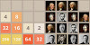

Beginning Page Speed Insights Scores:
27 Mobile
29 Desktop

Steps taken to optimize this project:

1. Add media="print" to <link href="css/print.css" rel="stylesheet">

2. Add async to <script src="http://www.google-analytics.com/analytics.js">

3. Move the inline script <script> (function(w,g){w['GoogleAnalyticsObject']=g; etc. out of the head and into the body.

4. Change style.css content location from <link href="css/style.css" rel="stylesheet"> to inline <style>.

5. Eliminate link to fonts: <link href="//fonts.googleapis.com/css?family=Open+Sans:400,700" rel="stylesheet">
 and its corresponding use in the css:
  body, button, input, select, textarea { font-family: 'Open Sans', sans-serif; color: #333; }

The steps above increased the scores to 30.

6. Change source for 3 images from an external link to my images folder. It might
not make a big change, but it will be handy to have all my images together for
later changes to improve optimization.
  - 
  becomes 

  - 
  becomes 
  - 
  becomes 

7. Minimize index.html

The steps above increased the score to 93 for mobile and 95 for desktop.

8. Resized pizzeria.jpg and compressed all of the images.
